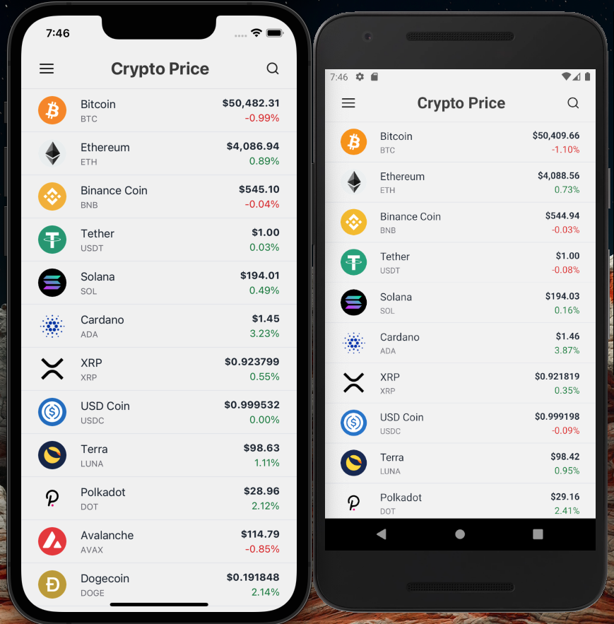

# Crypto Price App

    

## Description

A cryptocurrency price tracker which gets the cryptocurrencies from the [CoinLore API](https://www.coinlore.com/cryptocurrency-data-api) and displays them in a list with charts using React Native.

## Features:

- Crypto price tracker list
- Crypto price details
- Load more data on end reached
- Pull to refresh to update data
- Search bar to find the cryptocurrency
- Crypto chart
- Dark and Light theme support
- High Quality App icon
- Bootsplash screen for better UX
- React Navigation and React Native Screens
- Redux store
- more ...

## Setup

If you want to run the project from the repo:

1. Clone the repository `git clone https://github.com/msvargas/CryptoExchange.git`
2. Run `yarn install`
3. Run `yarn ios` for development or `yarn ios:prod` to run app in release mode on iOS devices (this script trigger automatically `pod install` with script preios)
4. Run `yarn android` or `yarn android:prod` to run the app on Android devices

# Scripts

- Run `yarn start` to start the packager
- Run `yarn clean` to clean the project to solved some conflicts on build process - [react-native-clean-project](https://www.npmjs.com/package/react-native-clean-project)
- Run `yarn test` to run the tests
- Run `yarn lint` to run the linter
- Run `yarn compile` to check typescript errors
- Run `yarn xcode` to open the project in Xcode
- Run `yarn ios:prod` to build the app for production and run it on iOS devices
- Run `yarn android:prod` to build the app for production and run it on Android devices

# Works on iOS and Android

# Resources

## Path aliases from the root of the project with babel and typescript:

https://koprowski.it/import-alias-in-react-native-and-vscode/

## App icon made with IconKitchen:

https://icon.kitchen/
